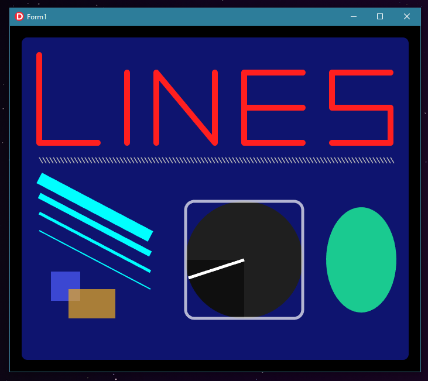
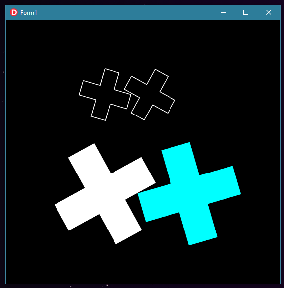

FAST-2D-Canvas

# About

This is a library that wraps D3D11 to provide functions for creating 2D graphics.  
It is extremely useful in situations in which hardware processing is needed, such as drawing very fast real-time graphics, with a large number of lines and polygons. In those occasions, it should outperform Direct2D considerably.  

# Examples

So far, there are two examples:  

- DrawShapes : Displays the result of drawing and filling functions rendered every 10ms:  
  

- DrawPaths : Uses the path funcionality to create a gear shaped polygon which is replicated four times and rotated constantly.  
  

# Setup 

It's recomended to use a component with ovewritten WM_PAINT and WM_ERASEBKGND handlers, so it doesn't interfere with the library's painting. That can be achieved by creating a simple TPanel child:

```
type
  TContainer = class(TPanel)
    private
      procedure WMPaint     (var Msg : TWMPaint); message WM_PAINT;
      procedure WMEraseBkgnd(var Msg : TMessage); message WM_ERASEBKGND;
  end;
  
(...)

procedure TContainer.WMPaint(var Msg : TWMPaint);
var
  PS: TPaintStruct;
begin
  BeginPaint(Handle, PS);
  EndPaint(Handle, PS);
end;

procedure TContainer.WMEraseBkgnd(var Msg : TMessage);
begin
  //
end;
```

In order to initialize the canvas, you must pass as parameter a TF2DCanvasProperties struct, containing the dimensions and HWND of the parent:  

```
(...)

uses
  F2DTypesU,
  F2DCanvasU; 
  
(...)

procedure InitializeCanvas;
var
  f2dProp : TF2DCanvasProperties;
begin
  with f2dProp do
  begin
    Hwnd   := m_pnlContainer.Handle;
    Width  := m_pnlContainer.ClientWidth;
    Height := m_pnlContainer.ClientHeight;
    MSAA   := 8;
  end;

  //////////////////////////////////////////////////////////////////////////////
  ///  Create canvas
  m_f2dCanvas := TF2DCanvas.Create(f2dProp);
  
end;
```

For drawing, use BeginDraw and EndDraw calls:  

```
  m_f2dCanvas.BeginDraw;
  
  m_f2dCanvas.Clear;
  
  // Setup and drawing functions
  (...)

  m_f2dCanvas.EndDraw;
```

# Draw functions

- DrawLine - Draws a line from point A to point B with the specified Width. If no width is provided, the value in the property LineWidth will be used:  
```
procedure DrawLine(a_pntA, a_pntB : TPointF; a_sLineWidth : Single = -1); 
procedure DrawLine(a_dPntAX, a_dPntAY, a_dPntBX, a_dPntBY : Double; a_sLineWidth : Single = -1); 
```

- DrawRect - Draws a rect delimited by points A and B with the specified Width. If no width is provided, the value in the property LineWidth will be used:  
```
procedure DrawRect(a_pntA, a_pntB : TPointF; a_sLineWidth : Single = -1); 
procedure DrawRect(a_dPntAX, a_dPntAY, a_dPntBX, a_dPntBY : Double; a_sLineWidth : Single = -1); 
```

- DrawRoundedRect - Draws a rect delimited by points A and B with rounded corners specified by the radius parameter and the specified width. If no width is provided, the value in the property LineWidth will be used:  
```
procedure DrawRoundRect(a_pntA, a_pntB : TPointF; a_dRadius : Double; a_sLineWidth : Single = -1);  
procedure DrawRoundRect(a_dLeft, a_dTop, a_dWidth, a_dHeight, a_dRadius : Double; a_sLineWidth : Single = -1); 
```

- DrawArc - Draws an arc with the specified X and Y radius, starting at a specific point and rotating a specific amount. The a_dStart and a_dSize range from 0 to 1 and represent the percentage of the circle's circunference. If no width is provided, the value in the property LineWidth will be used:  
```
procedure DrawArc(a_pntC : TPointF; a_dRadiusX, a_dRadiusY, a_dStart, a_dSize : Double; a_sLineWidth : Single = -1); 
procedure DrawArc(a_dLeft, a_dTop, a_dRadiusX, a_dRadiusY, a_dStart, a_dSize : Double; a_sLineWidth : Single = -1); 
```

# Fill functions

- FillRect - Fills a rect delimited by points A and B.  
```
  procedure FillRect(a_pntA, a_pntB : TPointF);  
  procedure FillRect(a_dLeft, a_dTop, a_dWidth, a_dHeight : Double); 
```

- FillRoundRect - Fills a rect delimited by points A and B with rounded corners specified by the radius parameter.
```
procedure FillRoundRect(a_pntA, a_pntB : TPointF; a_dRadius : Double);  
procedure FillRoundRect(a_dLeft, a_dTop, a_dWidth, a_dHeight, a_dRadius : Double); 
```

- FillArc - Fills an arc with the specified X and Y radius, starting at a specific point and rotating a specific amount. The a_dStart and a_dSize range from 0 to 1 and represent the percentage of the circle's circunference.
```
procedure FillArc(a_pntC : TPointF; a_dRadiusX, a_dRadiusY, a_dStart, a_dSize : Double); 
procedure FillArc(a_dLeft, a_dTop, a_dRadiusX, a_dRadiusY, a_dStart, a_dSize : Double); 
```

# Customizability

There are two painting styles: drawing and filling. Drawing implies outlining the shape, while filling fills it with the specified color. Colors must be setted by changing the correspondent property of the canvas:

```
m_f2dCanvas.DrawColor := $FFFF0000; // Sets red color for drawing
m_f2dCanvas.FillColor := $9F00FF00; // Sets alpha green color for filling
```

Drawing funcions will utilize the line style specified by the following properties:

```
m_f2dCanvas.LineCap := lcRound; // Lines will have rounded ends
m_f2dCanvas.LineCap := lcMitter; // Lines will have cutted ends
m_f2dCanvas.LineWidth := 2.5; // Every shape drawed will be 2.5px wide
```

# Paths

Use the TF2DPath type for creating a geometry. In order for the triangulation algorithm to properly work, points must be added in order to create a clockwise defined geometry. Points can be added and removed individually, and edited by transforming procedures, which changes all points at once.  

- AddPoint - Adds a point in the specified coordinates:  
```
procedure AddPoint(a_pntNew : TPointF); overload;
procedure AddPoint(a_dX, a_dY : Double); overload;
```

- RemovePoint - Removes a point in the specified coordinates:  
```
procedure RemovePoint(a_pntDel : TPointF); overload;
procedure RemovePoint(a_dX, a_dY : Double); overload;
```

- Scale - Multiplies all points by the specified values:  
```
procedure Scale (a_dX, a_dY : Double);
```

- Offset - Adds all points by the specified values:  
```
procedure Offset(a_dX, a_dY : Double);
```

- Rotate - Rotates all points by a specified amount around a specified point:  
```
procedure Rotate(a_pntRef : TPointF; a_dRatio : Double);
```

- FlipX - Multiplies all Xs by -1, flipping the image around the Y axis:
```
procedure FlipX;
```

- FlipY - Multiplies all Ys by -1, flipping the image around the X axis:
```
procedure FlipY;
```

- DrawPath - Draws the specified path:
```
procedure DrawPath(a_f2dPath : TF2DPath);
```

- FillPath - Fills the specified path:
```
procedure FillPath(a_f2dPath : TF2DPath);
```

A simple example:

```
procedure RenderScreen;
var
  f2dPath : TF2DPath;
begin
  m_f2dCanvas.BeginDraw;
  m_f2dCanvas.Clear;

  m_f2dCanvas.LineWidth := 1.5;
  m_f2dCanvas.LineCap   := lcRound;
  m_f2dCanvas.DrawColor := $FFFFFFFF;
  m_f2dCanvas.FillColor := $FFFFFFFF;

  f2dPath := TF2DPath.Create;

  // Uses AddPoint procedure for adding points:
  f2dPath.AddPoint(0, 0);
  (...)

  f2dPath.Scale(10, 10);
  f2dPath.Offset(100, 150);
  f2dPath.Rotate(PointF(200, 150), 0.5);
  
  m_f2dCanvas.DrawPath(f2dPath);
  m_f2dCanvas.FillPath(f2dPath);
  m_f2dCanvas.EndDraw;
end;
```
